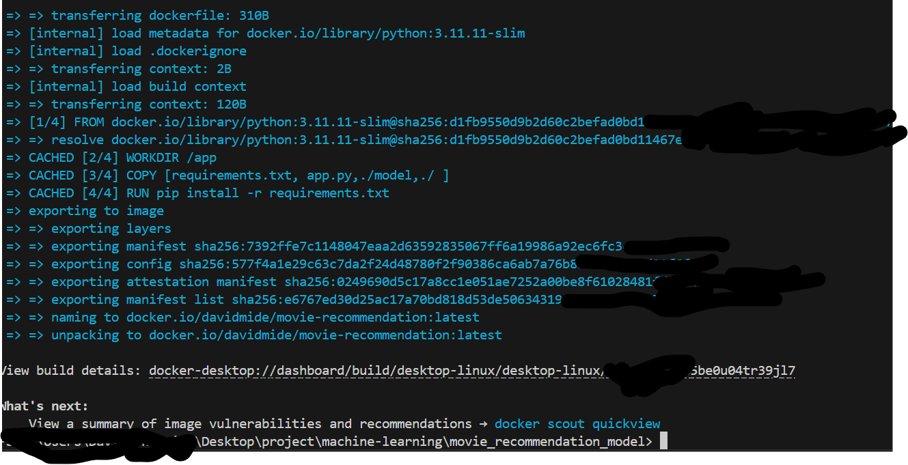
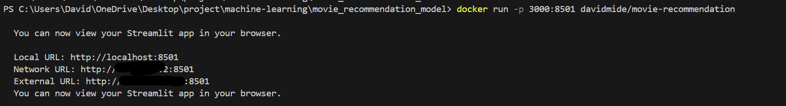

# 🎥🎬 Movie Recommendation Model (Content-Based) 🎥🎬
Author : Adenusi David O.


## Problem
At the start of movie streaming platforms they struggle to keep user engagement to improve it and continually keep user engaged with content base on their interactipon on the platform. Recommendation systems are crucial in today’s digital world, enhancing user experience on platforms like Netflix, Amazon Prime, and YouTube by suggesting relevant content.

## Overview

This project implements a content-based movie recommendation system using Python and libraries from scikit-learn. The model leverages the **CountVectorizer** to vectorize text data and **cosine_similarity** to compute similarity scores, enabling it to recommend movies based on textual features like genres, crew and other metadata.

## AIM
- Train a model that can recommend movies base on the content the user interact with.

## Features

- **Content-Based Filtering**: Recommends movies similar to a given movie based on text features.
- **Text Vectorization**: Converts textual metadata into numerical vectors using CountVectorizer.
- **Similarity Computation**: Uses cosine similarity to find and rank similar movies.
- Scalable to various textual features like genres, keywords, or cast and crew information.


## Dataset

The model requires a dataset containing movie metadata.

link to [dataset](https://www.kaggle.com/tmdb/tmdb-movie-metadata?select=tmdb_5000_movies.csv)
Download the two available datasets there
1. tmdb_5000_movies.csv
2. tmdb_5000_ credits.csv

## 📈 EDA
Dataset is well prepared, without duplicates and null values. You can explore detailed information in [notebook](notebook.ipynb)

## Model training

- Cosine_similarity


## Python scripts for data pre-processing and training
- [notebook](notebook.ipynb)
- [train_model.py](train_model.py)
Note : running of any of the script above will pre-process the dataset automaically and train the model.

## Prerequisites

Before running the project, ensure you have the following installed:

- Python 3.8+
- Libraries:
  - scikit-learn
  - pandas
  - numpy

You can install the required libraries using:

```bash
pip install -r requirements.txt
```


## How It Works

1. **Data Preparation**: Load the dataset and clean the text features.
2. **Text Vectorization**: Use **CountVectorizer** to transform textual data into a numerical feature matrix.
3. **Compute Similarities**: Calculate pairwise cosine similarity scores for all movies.
4. **Recommendation**: For a given movie, rank all other movies by similarity score and return the top recommendations.

## Usage

1. Clone this repository:

```bash
git clone https://github.com/Davidmide02/movie_recommendation_model.git
```

2. Navigate to the project directory:

```bash
cd movie_recommendation_model
```

3. Create a virtual environment :

```bash
python -m venv movie_venv
```
4. Install project requirements 
You can install the required libraries using:

```bash
pip install -r requirements.txt
```
5. Download the [datasets](https://www.kaggle.com/tmdb/tmdb-movie-metadata?select=tmdb_5000_movies.csv), create a folder name it *data* in the project director and move the two downloaded datasets to the data folder.

6. Run the script:

# run this jupyter notebook file to generate the models
- You'll find the genetated models in the model folder(this will be created automatically when you run the jupyter notebook)

[notebook.ipynb](notebook.ipynb)

### Now run,

```bash
streamlit run app.py
```
Boom 💥 your app is ready

## Instruction to reproduce

To reproduce this project, kindly follow the instructions/comments  in the [notebook](notebook.ipynb), they're clear and precise

## Deployemnt 
Check demo of the model [here](./assest/demo.mp4)
Using the [Dockerfile](Dockerfile) 

1. Build the dockerImage
```bash
docker build image-name .
```
note the **image-name** is want you want the name of the image to be 
If the image is successfull built you should have something similar to the image below
You access it in port localhost:3000 



2. Run the docker image you just built  and map the exposed port to port 3000 of the host
```bash
docker run -p 3000:8501 image-name .
```
If the image is successfull run you should have something similar to the image below
You should be able to access the service on port 3000 on your localhost 127.0.0.1:3000


- [Dockerfile](Dockerfile)

## Limitations

- **Cold Start Problem**: The system cannot recommend movies for new users or movies with insufficient metadata.
- **Overfitting on Text**: Recommendations heavily depend on the quality of textual metadata.

## Future Improvements

- Incorporate user ratings or preferences for hybrid filtering.
- Use more advanced NLP techniques like embeddings (e.g., Word2Vec or BERT).
- Deploy the model as a web or mobile application.

## Contributions

Feel free to fork this repository and contribute! Open issues or submit pull requests for any improvements or bug fixes.

## License

This project is licensed under the MIT License. See the LICENSE file for details.
